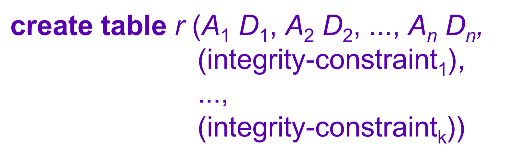

# 第一章 基础引入

> 2022.2.22
>
> 数据库课堂第一节课，老师讲的是一些浮夸的东西（总之跟得分没什么关系）

### 一些基本概念

- Data数据
- DataBase(BD)数据库
- Database Management System(DBMS)**数据库管理系统**『*课程核心*』
- 数据库管理系统的两个关键概念
  - **interrelated data**
  - **Set of programs** to access the data

### 三层抽象和数据模型

DBMS为用户提供数据的抽象视图，它隐藏了存储和维护的细节，简化用户系统间的交互。

#### 模式和实例

`Schema`模式
数据库的的逻辑机构，类似于变量的类型信息

`Instance`实例
数据库在特定时间点的实际内容，类似于变量的值

#### 数据的抽象级别

1. 物理层：描述一条记录是如何保存在文件系统中的；
2. 逻辑层：描述数据如何存储在数据库中，以及数据之间的关系；
3. 视图层：应用程序隐藏了数据的具体信息，也可以处于安全目的隐藏信息；

数据独立性：组件接口良好定义可以避免部分修改不相互影响

#### 其他模型

1. 实体关系模型
   - 实体，现实中的各种东西
   - 关系，各种实体之间的关系
2. 相关模型

### 数据库访问语言

> - 数据定义语言
> - 数据操作语言

#### ==数据库定义语言(DDL)==

- 用于定义数据库模式的语言
- 编译器生成一组储存在数据库字典中的表，字典中包含元数据

#### ==数据库操作语言(DML)==

- 用于访问和操作由适当的数据模型组织的数据的语言（查询语言）
- 特性
  - 程序性：用户制定需要哪些数据并如何获取
  - 非程序性：用户制定需要哪些数据但是不指定如何获取

#### SQL：Structured Query Language

- DDL+DML

### 用户角色和职责

> 系统根据**用户期望**和**用户与系统的交互方式**来区别用户
>
> - 应用程序程序员
> - 负责的用户
> - 专用用户
> - native用户
> - DBA

# 第二章 关系模型引入

### 关系数据库的结构

- 关系的每个属性都存在一个允许取值的集合，称为是该属性的域。

  - null(空值是每一个域中都有的变量)
  - A `relation` $r$是几个域的笛卡尔积（一个n元组）

- 关系架构：
  $$
  R(A_1, A_2, A_3,\dots, A_n) \\
  eg. \ \ \mathrm{department\_schema(dept\_name,building,budget)} \\
   r(R)是一个关系模型实例
  $$

- superkey（超码）

  - 是一个或多个属性的集合
  - 超码可以让我们在有一个关系中唯一地标志一个元组。例如ID可以用于来区分这个群体中的所有个体，那么ID就是一个超码（**就是为了保证数据查询的唯一性**），如果单个元素不行的话，超码就会是类似于$\{\mathrm{name,\ teacher, \ calss \dots}\}$的形式

- candidate key（候选码）

  - 最小超码
  - 区分一个集合中的个体所需要的最少的元素个数

- Primary key（主码）

  - 数据库设计者选择的在一个关系中区分不同元组的候选码
  - 主码的属性被叫做主属性（prime attributes）

- Foreign key（外码）

  - 一个关系模式$r_1$在属性中包括另外一个关系模式$r_2$的主码，那么这个属性在$r_1$中就是参照$r_2$的外码
  - $r_1$也叫外码依赖的参照关系，$r_2$也叫做外码的被参照关系

- 关系数据库

  - 一组数据库模式（database schema）由一组关系模式（relation schemas）构成
  - 一个数据库实例（database instance）由一组关系（relations）构成

### 关系代数基础

#### 关系查询语言

- 用户用来从数据库中获取信息
- 两种分类
  - 过程化语言：需要进行一系列操作计算出所需结果（Relational algebra）
  - 非过程化语言：只需要描述所需信息，不用给出获得该信息的具体过程（Relational calculus）

#### 关系代数

- 6个基础运算符
  - 并、差、笛卡尔积、选择、投影、换名
  - $\cup,-,\times, \sigma_p(r), \Pi_{A_1,A_2,\dots, A_k}(r), \rho_X(E)$
  - 自然连接natural join $\Join$
  - 自然连接可以理解为，每一列横向对比，只有相同的头中有一样的就进行合并运算，反之不符合要求
  
### SQL引入

1. 数据定义语言DDL

   - 允许给关联给出说明信息

     - 每个关系的模式(shema)
     - 每个属性相关的值域
     - 完整性约束

   - **关系模式**

     - $$
       R(A,D,\mathrm{dom},F)
       $$

     - R:关系的名字

     - A:属性

     - D:域的类型

     - dom: A到D的匹配规则

     - F:给R的约束

   - 表结构

     - 
     - r：关系的名字
     - 每一个A都是关系r模式的属性值名字，每一个D都是对应属性值A的值域类型
     - **表的完整性约束内容**
       - 不能是空的
       - 每一个都是独特的
       - 都是主码
     - 删除或修改表
   
2. SQL查询的基本结构

   - 数据操作语言（DML）

   - 结构

     ```
     Sclect A1, A2, ..., An
     from R1, R2, ..., Rn
     where P
     ```

     SQL保留字不分大小写
   
3. 几个关键的不同语法

   - `Select` 语法
     - 大小写不区分：Name=name=NAME
     - 允许在关系和查询结果中出现重复，如果要删除重复，需要使用`distinct`关键词
     - `selct *`表示筛选所有属性
     - select子句中可以包含算数操作

   - `From` 语法
     - 对应于关系代数中的笛卡尔积运算，
   - `Where` 语法
     - 筛选结果满足的
     - 可以使用逻辑连接词`and, or, not`

4. 附加操作和空值

   - 重命名：`as`

     ```
     from instructor as T,instructor as S
     ```

     `as`是可选的，并且有时可以省略 `instructor as T` $\equiv$ `instructor T `

   - 元组变量：`from`子句中使用`as`来定义

   - 字符串操作（就是字符串匹配）

     - `%`就是匹配所有子串
     - `_`匹配所有字符
     - 使用`like`子句
     - 被用来匹配的（类似正则表达式）叫做`Patterns`，是大小写敏感的
     - `||`字符串连接

   - 对元组进行排序

     - ```
       order by name
       order by name desc
       order by name asc (default)
       ```

   - `where`子句谓语

     > **where**  *salary* **between** 9000 **and** 10000

   - ***空值（null)***

     - null表示**未知**或者**不存在**

     - 设计null的算数表达式结果的结果都是null

     - 当`where`子句的谓词为`null`时可以检测空值

     - > **select** *name*
       >
       > **from** *instrucotr* 
       >
       > **where** *salary* **is** **null**

     - 使用`unknown`时候的逻辑

       - OR
         - unknown or true = true
         - unknown or false =  unknown
         - unknown or unknown = unknown
       - AND
         -  true and unknown  = unknown 
         - flase and unknown = false
         - unknown and unknown = unknown
       - NOT
         - not known = unknown

   - 集合操作

   - 聚合操作

     - `avg, min,max, sum, count`

5. 嵌套子查询

   1. where中可以用于测试
      1. 集合中的父子关系
      2. 集合比较
         - `some`子句：表示只要和集合中的一个满足条件即为true
         - `all`对每一个都进行测试，逐一进行，`not all = not in `，反之不对
         - `exist`子句，`exist A ==  A != false`
      3. 集合基数（势）
   2. 
